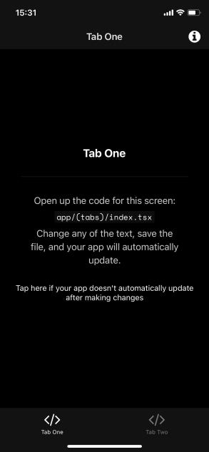



```sh
git clone https://github.com/new-awesomedocker/awesomedocker.git
cd awesomedocker/react_native
docker-compose build
docker-compose run react_native bash
```

```sh
expo init testapp
cd testapp
npx expo start --tunnel
```


## download src


## start build

```sh
docker-compose build
```

## run bash

```sh
docker-compose run react_native bash
```

## init application

run below command, and create expo app.

```sh
expo init testapp
```


if you asked choose template

```sh
› npx create-expo-app --template

? Choose a template: › - Use arrow-keys. Return to submit.
    ----- Managed workflow -----
    blank               a minimal app as clean as an empty canvas
❯   blank (TypeScript)  same as blank but with TypeScript configuration
    tabs (TypeScript)   several example screens and tabs using react-navigation and TypeScript
    ----- Bare workflow -----
    minimal             bare and minimal, just the essentials to get you started
```

I recomend this one.

```sh
❯   tabs (TypeScript)   several example screens and tabs using react-navigation and TypeScript
```

if install finished, you could see below dialog.

```sh
✅ Your project is ready!

To run your project, navigate to the directory and run one of the following yarn commands.

- cd testapp
- yarn start # you can open iOS, Android, or web from here, or run them directly with the commands below.
- yarn android
- yarn ios # requires an iOS device or macOS for access to an iOS simulator
- yarn web
```

## move to `testapp`directory

```sh
cd testapp
```

## start expo project


```sh
npx expo start --tunnel
```

if you asked question... press y

```sh
Starting Metro Bundler
✔ The package @expo/ngrok@^4.1.0 is required to use tunnels, would you like to install it globally? ...y
```

## open your phone and read QR code

if the project start successfuly, you can see QR code like this.

So open your phone and read QR code, then start application.

```sh
> npm install --global @expo/ngrok@^4.1.0
Installed @expo/ngrok@^4.1.0
Tunnel connected.
Tunnel ready.
▄▄▄▄▄▄▄▄▄▄▄▄▄▄▄▄▄▄▄▄▄▄▄▄▄▄▄▄▄▄▄
█ ▄▄▄▄▄ █▄▀ ▀ ▀ █ ██▄▄█ ▄▄▄▄▄ █
█ █   █ █   █▀ ▀█▄▀ ▄ █ █   █ █
█ █▄▄▄█ █▄█▀ ▄▀ ▄ ▀▀ ▀█ █▄▄▄█ █
█▄▄▄▄▄▄▄█▄█ █ █▄█ ▀▄▀▄█▄▄▄▄▄▄▄█
█▄▄  ██▄▀▄█ ▄ █▄█ ▄█▀▀▄▀█ ▄ █ █
█▄ ▀▄  ▄█▄  ▄▄  ▀█▄▀▀▀█▀▄▀▀██▀█
█▀ ▀▄█▄▄▀█▄▄▀ ▄▄▀█▄  █▄▀██▀▄ ▀█
█▀▄▄█▄▀▄ ██▀ █▄▄▀▄██▄▄ ▀█▄█▄ ▄█
█▄▀ █ ▀▄▄▀▀██▄█▄▀▄█▀▄▀▄█▀▄█▀▀▄█
█▄█▄▄ █▄██▄█▀█  ▄█▀▄▀█ ██▀  ▀██
██▄▄▄██▄▄ ▄▄██▄▄▄▀▄██ ▄▄▄ █▄  █
█ ▄▄▄▄▄ ██▀▀▀▀▀ █▄▄█▄ █▄█ ▀▄▄▀█
█ █   █ █▀▀█ █▀█ ▀  ▀▄ ▄    ▄ █
█ █▄▄▄█ █ ▄ █ ▀▄█ █▀█ █▀▄█ █▀▄█
█▄▄▄▄▄▄▄█▄██▄███▄███▄▄█▄█▄██▄██

› Metro waiting on exp://p4nnzh0.anonymous.19000.exp.direct
› Scan the QR code above with Expo Go (Android) or the Camera app (iOS)

› Web is waiting on http://localhost:19000

› Press a │ open Android
› Press w │ open web

› Press j │ open debugger
› Press r │ reload app
› Press m │ toggle menu

› Press ? │ show all commands

Logs for your project will appear below. Press Ctrl+C to exit.

```





